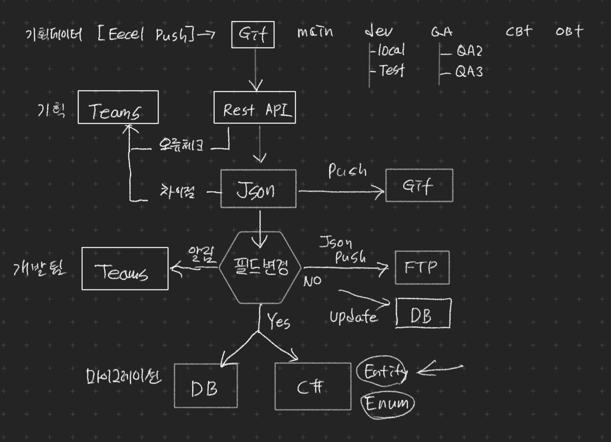

<div align="center">

# 기획데이터 변환 프로젝트



</div>

## Description

> 게임 기획데이터[EXCEL]를 서버와 클라이언트의 데이터로 변환해주는 프로젝트 입니다.

## 사용 방법

> 엑셀 데이터 작성후 GIT으로 PUSH!!
>
> 나머지는 서버에서 자동으로 처리합니다.

## Folder structure

```
루트경로
├── docs                                # 각종 문서
├── excel                               # 변환의 대상이 되는 엑셀파일폴더
│   ├── data                            #   기획데이터
│   │   ├── data1.xlsx                  #     변환 대상 엑셀파일
│   │   ├── data2.xlsx                  #     변환 대상 엑셀파일
│   │   ├── data3.xlsx                  #     변환 대상 엑셀파일
│   │   ├── data4.xlsx                  #     변환 대상 엑셀파일
│   ├── enum                            #   ENUM데이터
│   │   ├── enum_data.xlsx              #     변환 대상 엑셀파일
│   ├── info                            #   개발디비데이터 (개발자만사용)
│   │   ├── server_info.xlsx            #   변환 대상 엑셀파일 
├── export                              # 변환되는 폴더 (자동생성)
├── ├── json                            # 변환되는 JSON 폴더
│   │   ├── client                      #   클라로 사용되는 폴더 
│   │   ├── server                      #   서버로 사용되는 폴더 
│   │   ├── info                        #   디비로 사용되는 폴더 
├── prisma                              # 변환되는 디비 스키마 폴더 (자동생성)
│   ├── prisma.schema                   #   디비에 저장되는 스키마파일 
```

## 엑셀 데이터 작성 방법

> excel 디렉토리 안에 엑셀파일을 생성합니다. 폴더안의 모든 엑셀파일을 검색하기 때문에 커스텀폴더를 사용하셔도 무방합니다.
>
> 엑셀 파일명이 DB TABLE 및 Json파일 명으로 사용됩니다.
>
> 엑셀 파일의 첫번째 시트만 작업기준으로 사용됩니다. 나머지 시트는 자유롭게 사용하시면 됩니다.

* 아래와 같이 총 3개의 고정열과 데이터로 구성됩니다.

| 컬럼명     | id     | table_id | table_sub_id    | item_rate     | reg_dt          | status   |
|---------|--------|----------|-----------------|---------------|-----------------|----------|
| 1.타겟타입  | SERVER | SERVER   | SERVER          | SERVER        | SERVER          | SERVER   |
| 2.데이터타입 | long   | int      | int             | float         | datetime        | string   |
| 3.디비스키마 | @auto  | @id      | @ref(테이블명.필드ID) | @default(1.1) |                 | @size(1) |
| 데이터     | 0      | 11       | 1               |               | 2022.5.19 11:11 | A        |

---

## 1. 타겟 타입 설명

| No. | 타겟 타입  | 설명                           |
|-----|--------|------------------------------|
| 1   | SERVER | 서버 변환용으로 사용됩니다.              |
| 2   | CLIENT | 클라 변환용으로 사용됩니다.              |
| 3   | INFO   | 디비 변환용으로 사용됩니다. (개발자만 사용)    |
| 4   | MEMO   | 단순 메모용으로 사용됩니다.              |
| 5   | 기타     | 상기 1-3 이외의 타입은 처리대상에서 제외됩니다. |

## 2. 데이터 타입 설명

| No. | Excel    | [Client(C#)](https://www.tutorialsteacher.com/csharp/csharp-data-types) | [Server(Java)](https://www.w3schools.com/java/java_data_types.asp) | [MSSQL](https://www.tutorialsteacher.com/sqlserver/data-types) | 사이즈     | 설명                                            |
|-----|----------|-------------------------------------------------------------------------|--------------------------------------------------------------------|----------------------------------------------------------------|---------|-----------------------------------------------|
| 1   | byte     | byte                                                                    | short                                                              | tinyint                                                        | 8-bit   | [0 - 255] 범위의 숫자만 사용                          |
| 2   | short    | short                                                                   | short                                                              | smallint                                                       | 16-bit  | [-32,768 - 32,767] 범위의 숫자만 사용                 |
| 3   | int      | int                                                                     | int                                                                | int                                                            | 32-bit  | [-2,147,483,648 - +2,147,483,647] 범위의 숫자만 사용  |
| 4   | long     | long                                                                    | long                                                               | bigint                                                         | 32-bit  | 주로 DB의 자동증가ID값이나 UUID값을 사용할시 사용됩니다.           |
| 5   | float    | float                                                                   | float                                                              | float                                                          | 32-bit  | [0, 1.0, 1.123456] 소수점 6자리까지 사용               |
| 6   | double   | double                                                                  | double                                                             | double                                                         | 64-bit  | int형 범위를 초과하는 경우 사용                           |
| 7   | bool     | bool                                                                    | boolean                                                            | bit                                                            | 8-bit   | [true, false 1, 0] 사용 가능                      |
| 8   | string   | string                                                                  | string                                                             | nvarchar                                                       | -       | 모든 문자 및 숫자 사용가능 & 개행 사용가능                     |
| 9   | datetime | DateTime                                                                | DateTime                                                           | datetime2                                                      | ISO8601 | [2022-05-16 04:43] 또는 [2022.05.16 12:00] 사용가능 |

## 3. 옵션 타입 설명

> 디비 스키마 구성 용도로 사용됩니다.
>
> 엑셀 데이터 체크 용도로 사용됩니다.

| No. | 타겟 타입          | 설명                                                                           |
|-----|----------------|------------------------------------------------------------------------------|
| 1   | @id            | 테이블의 기준이 되는 ID (이 값을 설정하면 누락값과 중복값을 체크합니다.)                                  |
| 2   | @null          | null값을 허용합니다. db나 데이터에 null값을 그대로 적용                                         |
| 3   | @size(숫자)      | 데이터 타입이 문자인 경우 디비 스키마에 @db.NVarChar(숫자)가 적용됩니다.                              |
| 4   | @default(숫자)   | 데이터 타입이 숫자인 경우 엑셀필드에 값을 넣지 않더라도 이 기본값이 적용됩니다.                                |
| 5   | @default("문자") | 데이터 타입이 문자인 경우 엑셀필드에 값을 넣지 않더라도 이 기본값이 적용됩니다.                                |
| 6   | @ref(테이블명.필드명) | 데이터 체크 용도로 사용되며 다른 엑셀파일의 아이디 값을 참조 하고있는경우 정의합니다.                             |
| 7   | @db.TinyInt    | 데이터 타입이 숫자인 경우 디비 스키마를 구성하고 싶은 경우 사용. 데이터 타입이 byte인경우 이 값을 넣지 않더라도 자동적용됩니다.  |
| 8   | @db.SmallInt   | 데이터 타입이 숫자인 경우 디비 스키마를 구성하고 싶은 경우 사용. 데이터 타입이 short인경우 이 값을 넣지 않더라도 자동적용됩니다. |
| 9   | @auto          | 디비에서 ID를 자동생성하고자 할때 사용(서버정보 INFO에서 사용)                                       |

## 기능 구현 상세

| Version | 기능             | 구현 여부 | 설명                                                               |  
|---------|----------------|-------|------------------------------------------------------------------|
| 1.0.0   | 데이터 변환 기능      |       | GIT에서 엑셀 데이터를 로드하여 Json으로 변환                                     |
|         | - CLIENT       | ❍     | GIT에서 엑셀 데이터를 로드하여 Json으로 변환후 client폴더로 저장                       |
|         | - SERVER       | ❍     | GIT에서 엑셀 데이터를 로드하여 Json으로 변환후 server폴더로 저장                       |
|         | - DB 스키마       | ❍     | GIT에서 엑셀 데이터를 로드하여 Prisma 스키마 변환후 prisma폴더로 저장                   |
|         | GIT PUSH 기능    | ❍     | 변환된 데이터의 변경이 있을 경우만 GIT PUSH                                     |
|         | 팀즈 PUSH 기능     | ❍     | 기획자가 GIT에 데이터 업로드시 팀즈로 메시지 알람기능                                  |
|         | DB 마이그레이션      | ❍     | 변환된 스키마를 GIT에서 다운받아 해당 브랜치의 서버로 데이터를 동기화                         |
|         | 로그저장           | ❍     | 엑셀 데이터 변환관련 처리 파일 로그 저장                                          |
| 1.0.1   | 데이터 타입 체크 기능   |       | 2.데이터타입 여부에 따라서 데이터의 값을 체크합니다.                                   |
|         | - byte         | ✕     | null값 & 데이터의 범위 0 - 255 체크                                       |
|         | - short        | ✕     | null값 & 데이터 범위 -32768 - 32768 체크                                 |
|         | - int          | ❍     | null값 & 데이터 범위 강제 int형 범위 변환                                     |
|         | - long         | ❍     | null값 & 데이터 범위 강제 int형 범위 변환                                     |
|         | - float        | ❍     | null값 & 데이터 범위 소수점 6자리까지 사용 0.123456                             |
|         | - double       | ✕     | null값 & 데이터 범위 강제 int형 범위 변환                                     |
|         | - bool         | ❍     | null값 & 데이터 범위 0 - 1 체크 & 1,0,false,true 적용                      |
|         | - string       | ❍     | null값 체크                                                         |
|         | - datetime     | ❍     | 날짜 형식 체크 & yyyy.m.d h:mm or yyyy-m-d h:mm 형식을 ios8601형식 변환       |
|         | 팀즈 PUSH 기능     | ❍     | 상기 체크 오류시 팀즈로 메시지 알람기능                                           |
| 1.0.2   | 스키마 체크 기능      | ✕     | 3.디비스키마옵션 여부에 따라서 데이터의 값을 체크합니다.                                 |
|         | @id            | ❍     | null값 & 중복 체크                                                    |
|         | @null          | ❍     | 데이터에 null 및 공백문자를 허용합니다. (null & ' ') -> json { key: null }      |
|         | @ref(테이블명.필드명) | ✕     | TODO: 다른테이블의 아이디를 참조하는 타입의 경우 해당 테이블에 키값이 있는지 체크합니다. 값이 0인경우는 무시 |
| 1.0.3   | 브랜치별 적용        | ❍     | 개별 브랜치를 생성하여 테스트 가능                                              |
|         | 개별 데이터 폴더 생성   | ✕     | TODO:사용자별 작업 폴더를 생성하여 서버에서 동시에 작업가능                              |
|         | 작업 대기열 적용      | ✕     | TODO:사용자별 요청을 디비에 저장하여 순차적으로 적용 가능                               |

### 현행 업무 사례

> 서버에서는 EXCEL데이터를 디비에 저장하여 사용
>
> 클라에서는 EXCEL데이터를 파일에 저장하여 사용

1. 기획자가 EXCEL작성후 SVN에 업로드
2. 개발자가 윈도우TOOL로 엑셀데이터를 디비업로드 (데이터추가)
3. 개발자가 업로드된 데이터의 오류 확인
4. 개발자가 수동으로 데이터베이스 스키마 수정
5. 기획자가 윈도우TOOL로 엑셀데이터를 바이너리파일로 변환
6. 기획자가 변환된 바이너리파일을 SVN에 업로드
7. 개발자가 변환된 바이너리파일을 CDN서버에 업로드
8. 기획자가 윈도우TOOL로 Enum을 변환후 SVN에 업로드

### 변경된 업무 사례

1. 기획자가 EXCEL작성후 Git에 업로드
2. 자동봇이 EXCEL데이터의 오류를 감지후 TEAMS메신저로 알림
3. 자동봇이 EXCEL을 JSON으로 변환후 Git에 업로드
4. 자동봇이 변경된 차이점 URL을 TEAMS메신저로 알림
5. 자동봇이 변환된 JSON파일을 데이터베이스에 업로드
6. 자동봇이 변환된 JSON파일을 CDN서버에 업로드
7. 자동봇이 Enum을 변환후 Client Git에 업로드

---

## Tech Stack

* [Python](https://www.python.org/)
* [Prisma](https://www.prisma.io/)
* [Caddy](https://caddyserver.com/docs/)
* [Docker](https://www.docker.com/)
* [FastAPI](https://fastapi.tiangolo.com/)
* [Gunicorn](https://gunicorn.org/)
* [Httpx](https://www.python-httpx.org/)
* [Pip-tools](https://github.com/jazzband/pip-tools)
* [Pydantic](https://pydantic-docs.helpmanual.io/)
* [Pytest](https://docs.pytest.org/en/latest/)
* [Starlette](https://www.starlette.io/)
* [Uvicorn](https://www.uvicorn.org/)

## Resources

* [Flask divisional folder structure](https://exploreflask.com/en/latest/blueprints.html#divisional)
* [Deploying APIs built with FastAPI](https://fastapi.tiangolo.com/deployment/)
* [Reverse proxying with Caddy](https://caddyserver.com/docs/caddyfile/directives/reverse_proxy)

<div align="center">
✨ 🍰 ✨
</div>

